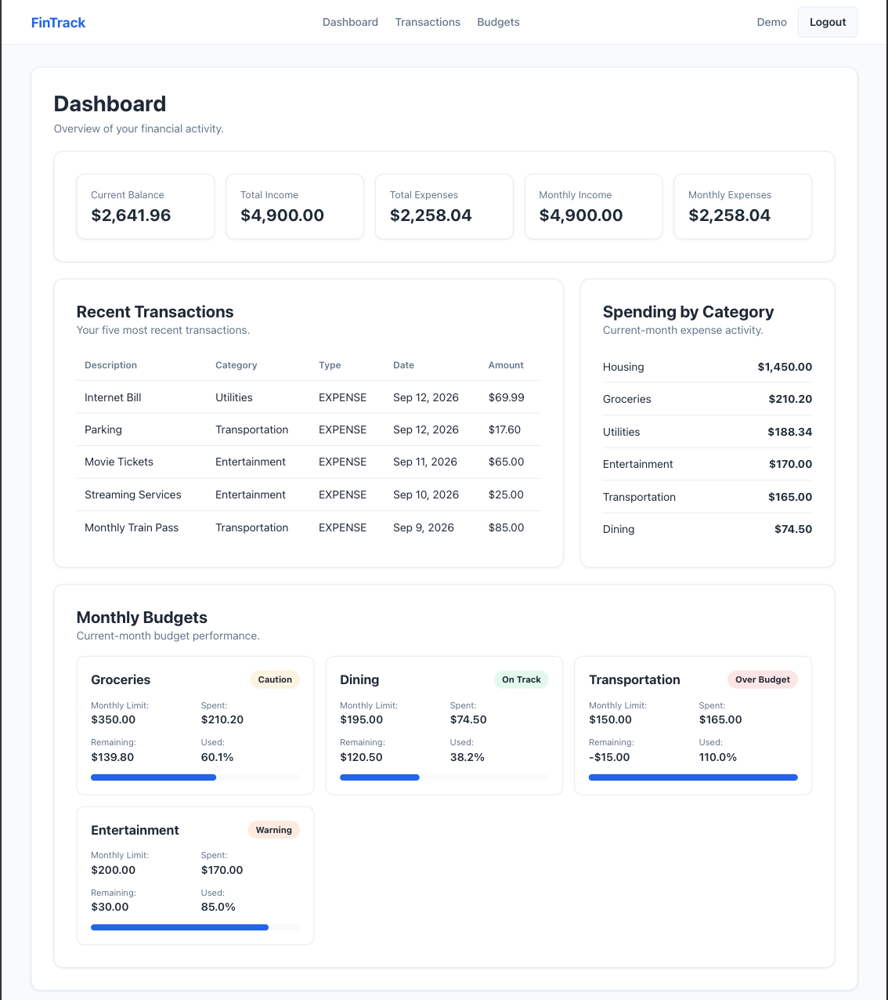
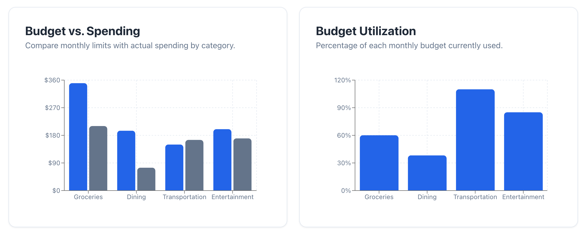
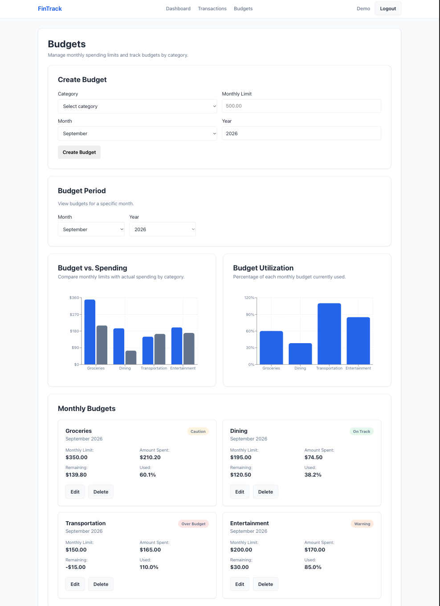
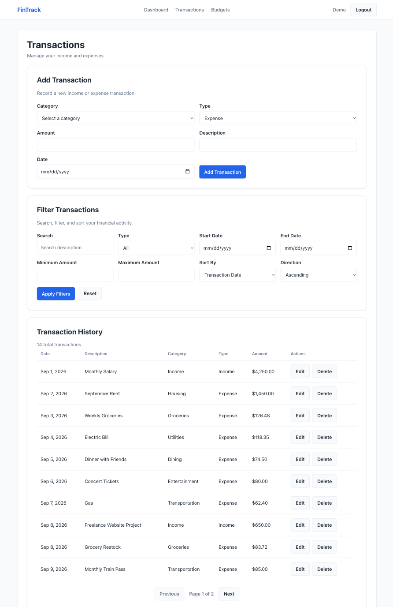

# FinTrack — Finance Operations Dashboard


FinTrack is a production-deployed full-stack personal finance application built with Java, Spring Boot, React, TypeScript, and MySQL. It provides secure account access, transaction and budget management, financial analytics, and a responsive dashboard.

The project demonstrates layered backend architecture, stateless JWT authentication, user-scoped data access, automated testing, and full-stack deployment across Vercel and Railway.

> **Demo project:** FinTrack uses fictional financial data only. It does not connect to banks, process real transactions, or provide financial advice.

---

## Live Demo

| Resource     | URL                                                                                                                                            |
| ------------ | ---------------------------------------------------------------------------------------------------------------------------------------------- |
| Application  | [finance-operations-dashboard.vercel.app](https://finance-operations-dashboard.vercel.app/)                                                    |
| Health Check | [finance-operations-dashboard-production.up.railway.app/api/health](https://finance-operations-dashboard-production.up.railway.app/api/health) |

---

## Project Highlights

- Full-stack React and Spring Boot application deployed through Vercel and Railway
- Stateless JWT authentication with BCrypt password hashing
- User-scoped transactions, categories, budgets, and dashboard data
- Search, filtering, sorting, pagination, and financial analytics
- Responsive dashboard visualizations built with Recharts
- Production CORS, environment-based secrets, and disabled production API documentation
- **152 passing backend tests** with **98% instruction coverage** and **94% branch coverage**
- **37 passing frontend tests** across **7 test files**

---

## Tech Stack

| Area             | Technologies                                                                                                  |
| ---------------- | ------------------------------------------------------------------------------------------------------------- |
| Backend          | Java 21, Spring Boot 4.1, Spring Web MVC, Spring Security, Spring Data JPA, Hibernate, Bean Validation, Maven |
| Frontend         | React 19, TypeScript 6, Vite, React Router, Recharts, custom CSS                                              |
| Database         | MySQL                                                                                                         |
| Authentication   | JWT, BCrypt                                                                                                   |
| Backend Testing  | JUnit 5, Mockito, Spring Boot Test, MockMvc, Spring Security Test, H2, JaCoCo                                 |
| Frontend Testing | Vitest, React Testing Library, jest-dom, jsdom                                                                |
| Deployment       | Vercel, Railway                                                                                               |

---

## Architecture

```text
React + TypeScript Frontend
          |
          | HTTPS / JSON / JWT
          v
Spring Boot REST API
          |
          v
Service Layer
          |
          v
Spring Data JPA / Hibernate
          |
          v
MySQL Database
```

The frontend communicates with the backend through `VITE_API_BASE_URL`. The backend owns authentication, authorization, validation, business logic, and persistence. MySQL credentials and backend secrets are stored only in Railway; they are never exposed to Vercel or browser code.

---

## Features

### Authentication

- User registration and login
- Session restoration after browser refresh
- Protected application routes
- Logout and session clearing

### Transactions

- Create, view, edit, and delete income and expense transactions
- Search transactions by description
- Filter by type, amount, and date
- Sort by amount, transaction date, or creation date
- Paginated transaction results

### Categories

- Default financial categories created for new users
- Category-based transaction and budget organization
- Duplicate category-name prevention
- Authenticated-user category ownership
- Backend API support for category management

### Budgets

- Create, edit, and delete monthly category budgets
- Filter budgets by month and year
- Prevent duplicate budgets for the same category and period
- Calculate spending, remaining balance, and utilization
- Display On Track, Caution, Warning, and Over Budget statuses

### Dashboard

- Display all-time and current-month financial totals
- Calculate the current balance
- Show recent transactions
- Group current-month spending by category
- Visualize budget progress and utilization with Recharts
- Support useful loading, error, and empty states

### Responsive Frontend

- Desktop, tablet, and mobile layouts
- Centralized, type-safe API communication
- Reusable currency and date formatting
- Direct route and browser-refresh support

---

## Security

- Stateless authentication using signed JWT access tokens
- Password hashing with BCrypt
- Protected frontend routes and backend API endpoints
- Authenticated-user ownership enforcement for transactions, categories, budgets, and dashboard data
- Cross-user resource isolation verified through automated tests
- Request validation and consistent API error handling
- Production CORS allowlist for approved Vercel origins
- Explicit support for browser preflight requests
- Secrets and database credentials supplied through environment variables
- Swagger/OpenAPI documentation disabled in production
- Hibernate SQL output disabled in production
- Stack traces and internal error details excluded from API responses

---

## Testing & Quality

| Test Suite       | Results                                           |
| ---------------- | ------------------------------------------------- |
| Backend          | **152 tests passing**                             |
| Backend Coverage | **98% instruction coverage, 94% branch coverage** |
| Frontend         | **37 tests passing across 7 test files**          |

### Backend Testing

The backend test suite uses JUnit 5, Mockito, Spring Boot Test, MockMvc, Spring Security Test, H2, and JaCoCo.

Coverage includes:

- Service-layer business logic
- Controller responses and request validation
- Repository queries and JPA Specifications
- JWT generation, validation, and authentication
- Spring Security configuration
- User ownership and cross-user data isolation
- Transaction search, filtering, sorting, and pagination
- Category initialization and duplicate prevention
- Budget calculations, analytics, and status behavior
- Dashboard aggregation
- Full authenticated application workflows

Backend tests use a dedicated `test` profile and an H2 in-memory database configured for MySQL compatibility.

Run the backend suite:

```bash
./mvnw clean test
```

The JaCoCo HTML report is generated at:

```text
target/site/jacoco/index.html
```

### Frontend Testing

The frontend test suite uses Vitest and React Testing Library.

Coverage includes:

- Authentication and protected routes
- Session restoration
- Dashboard loading, success, empty, and error states
- Transaction CRUD, filtering, sorting, and pagination
- Budget CRUD, analytics, charts, and business rules
- User-visible validation and API errors
- Local-storage token utilities

Run the frontend suite:

```bash
cd frontend
npm test -- --run
```

---

## Screenshots

### Dashboard

The dashboard summarizes income, expenses, recent activity, category spending, and monthly budget performance.



### Budget Analytics

Budget comparison and utilization charts show spending progress across budget categories.



### Budget Management

Users can create monthly budgets, select reporting periods, review analytics, and monitor budget status.



### Transaction Management

Users can record, edit, delete, search, filter, sort, and paginate through income and expense transactions.



---

## API Documentation

The health, registration, and login endpoints are public. All other endpoints require a valid JWT access token.

| Area           | Method   | Endpoint                      | Description                                     |
| -------------- | -------- | ----------------------------- | ----------------------------------------------- |
| Health         | `GET`    | `/api/health`                 | Check application health                        |
| Authentication | `POST`   | `/api/auth/register`          | Register a user                                 |
| Authentication | `POST`   | `/api/auth/login`             | Authenticate and receive a JWT                  |
| Authentication | `GET`    | `/api/auth/me`                | Get the authenticated user                      |
| Transactions   | `POST`   | `/api/transactions`           | Create a transaction                            |
| Transactions   | `GET`    | `/api/transactions`           | Search, filter, sort, and paginate transactions |
| Transactions   | `GET`    | `/api/transactions/{id}`      | Get a transaction                               |
| Transactions   | `PUT`    | `/api/transactions/{id}`      | Update a transaction                            |
| Transactions   | `DELETE` | `/api/transactions/{id}`      | Delete a transaction                            |
| Categories     | `POST`   | `/api/categories`             | Create a category                               |
| Categories     | `GET`    | `/api/categories`             | Get all categories                              |
| Categories     | `GET`    | `/api/categories/{id}`        | Get a category                                  |
| Categories     | `PUT`    | `/api/categories/{id}`        | Update a category                               |
| Categories     | `DELETE` | `/api/categories/{id}`        | Delete a category                               |
| Budgets        | `POST`   | `/api/budgets`                | Create a monthly budget                         |
| Budgets        | `GET`    | `/api/budgets`                | Get budgets for a selected period               |
| Budgets        | `GET`    | `/api/budgets/{id}`           | Get a budget                                    |
| Budgets        | `GET`    | `/api/budgets/{id}/analytics` | Get budget analytics                            |
| Budgets        | `PUT`    | `/api/budgets/{id}`           | Update a budget                                 |
| Budgets        | `DELETE` | `/api/budgets/{id}`           | Delete a budget                                 |
| Dashboard      | `GET`    | `/api/dashboard`              | Get the financial dashboard summary             |

Swagger/OpenAPI documentation is available locally at:

```text
http://localhost:8080/swagger-ui/index.html
```

Swagger/OpenAPI is intentionally disabled in production.

### Example Requests

#### Login

```http
POST /api/auth/login
Content-Type: application/json
```

```json
{
  "email": "demo@example.com",
  "password": "TestPassword123!"
}
```

#### Authenticated Request

```http
GET /api/dashboard
Authorization: Bearer <JWT>
```

---

## Project Structure

| Path                                                | Purpose                                                                  |
| --------------------------------------------------- | ------------------------------------------------------------------------ |
| `src/main/java/dev/portfolio/finance/config`        | Spring Security, CORS, and application configuration                     |
| `src/main/java/dev/portfolio/finance/controller`    | REST API controllers                                                     |
| `src/main/java/dev/portfolio/finance/dto`           | Validated request and response models                                    |
| `src/main/java/dev/portfolio/finance/entity`        | JPA entities and database relationships                                  |
| `src/main/java/dev/portfolio/finance/repository`    | Spring Data repositories and queries                                     |
| `src/main/java/dev/portfolio/finance/security`      | JWT authentication and request filtering                                 |
| `src/main/java/dev/portfolio/finance/service`       | Business logic and ownership enforcement                                 |
| `src/main/java/dev/portfolio/finance/specification` | Dynamic transaction filtering                                            |
| `src/main/resources`                                | Application and production configuration                                 |
| `src/test`                                          | Backend unit and integration tests                                       |
| `frontend/src`                                      | React components, pages, services, contexts, types, hooks, and utilities |
| `docs/sql`                                          | Documented MySQL scripts                                                 |
| `scripts`                                           | Local development scripts                                                |

---

## Deployment

| Component       | Platform |
| --------------- | -------- |
| React frontend  | Vercel   |
| Spring Boot API | Railway  |
| MySQL database  | Railway  |

- Vercel builds and deploys the React application from the `frontend` directory.
- Railway runs the Java 21 API with the `prod` Spring profile.
- The backend connects to MySQL through Railway private networking.
- Production configuration and secrets are supplied through environment variables.
- Vercel contains only the public backend API URL and no database credentials.
- Direct React routes are supported through a Vercel SPA rewrite.

---

## Local Development

### Prerequisites

- Java 21
- MySQL
- Node.js and npm
- Git

### Clone the Repository

```bash
git clone https://github.com/garrib10/finance-operations-dashboard.git
cd finance-operations-dashboard
```

### Backend

Create the local environment file from the provided example and supply your own development values:

```bash
cp .env.example .env
```

Required backend variables:

- `DB_URL`
- `DB_USERNAME`
- `DB_PASSWORD`
- `JWT_SECRET`
- `JWT_EXPIRATION_MS`

Start the Spring Boot API:

```bash
./scripts/run-local.sh
```

The backend runs at `http://localhost:8080`.

- Health endpoint: `http://localhost:8080/api/health`
- Swagger UI: `http://localhost:8080/swagger-ui/index.html`

### Frontend

From the project root:

```bash
cd frontend
npm install
```

Create `frontend/.env.local`:

```env
VITE_API_BASE_URL=http://localhost:8080
```

Start the Vite development server:

```bash
npm run dev
```

The frontend runs at `http://localhost:5173`.

---

## Future Improvements

- Add database migrations with Flyway or Liquibase
- Add refresh-token support and token revocation
- Add a custom-category workflow where selecting `Other` displays a field for entering and saving a new category
- Add automated CI/CD quality gates with GitHub Actions
- Add production monitoring and structured application metrics
- Build a separate Selenium end-to-end automation suite covering deployed FinTrack workflows
- Automatically scroll to and focus the transaction form when a user selects a transaction to edit

---

## License

This project is licensed under the [MIT License](LICENSE).
