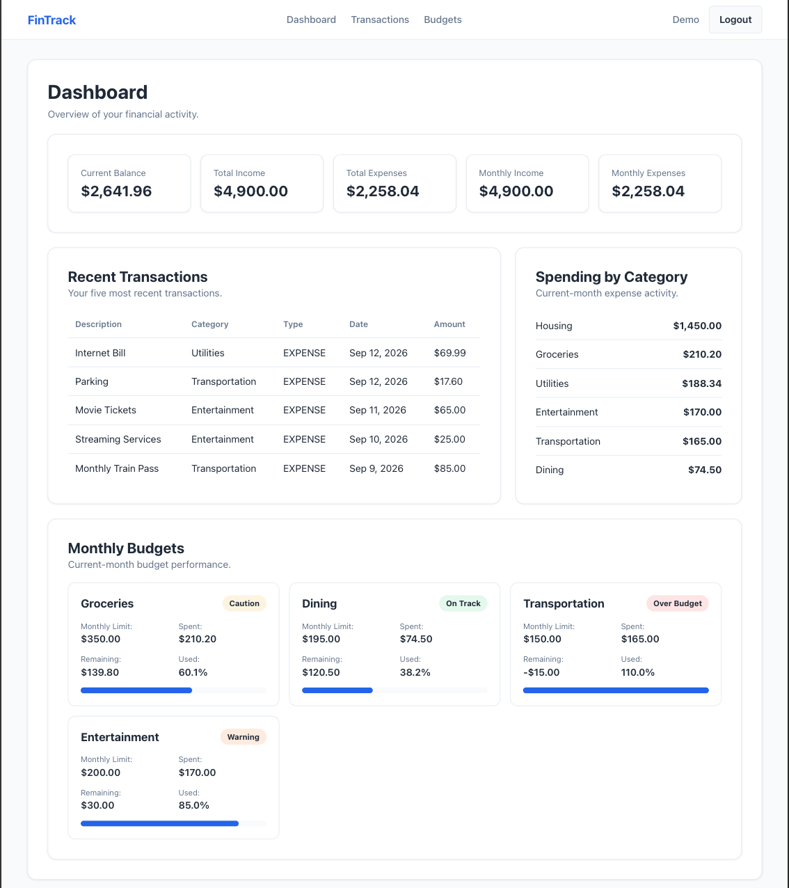
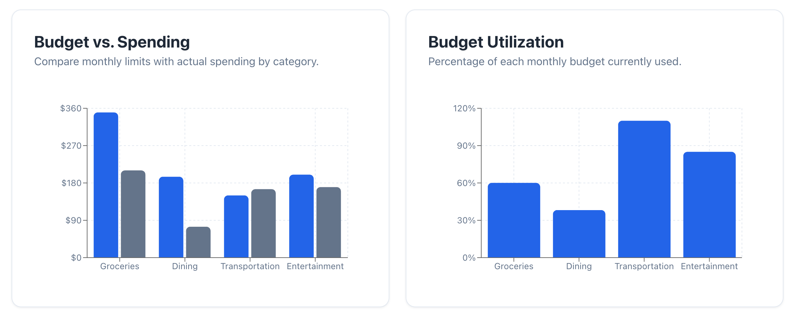
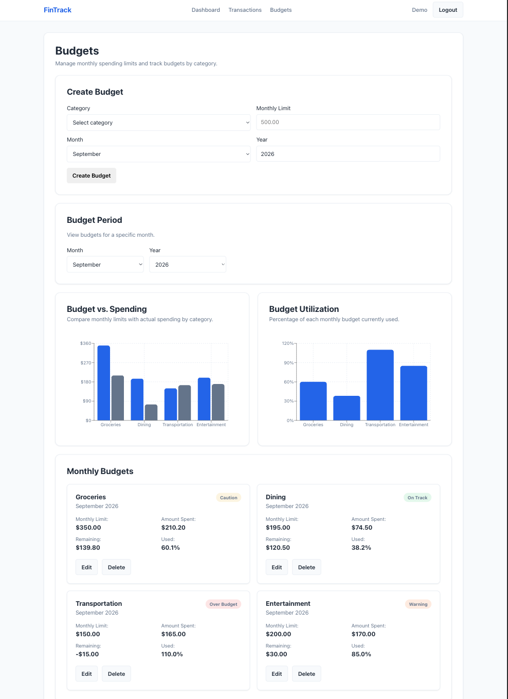
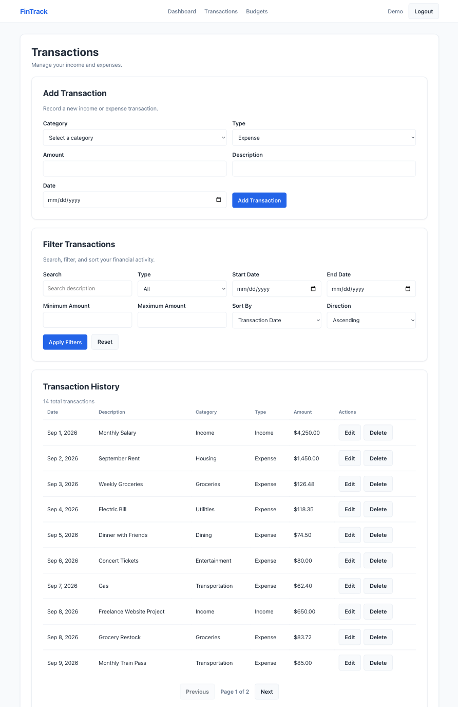

# FinTrack — Finance Operations Dashboard


FinTrack is a production-deployed full-stack personal finance application built with Java, Spring Boot, React, TypeScript, and MySQL. It provides secure account access, transaction and budget management, financial analytics, and a responsive dashboard.

The project demonstrates layered backend architecture, short-lived JWTs with rotating refresh-token sessions, user-scoped data access, automated testing, and full-stack deployment across Vercel and Railway.

> **Demo project:** FinTrack uses fictional financial data only. It does not connect to banks, process real transactions, or provide financial advice.

---

## Live Demo

| Resource     | URL                                                                                                                                            |
| ------------ | ---------------------------------------------------------------------------------------------------------------------------------------------- |
| Application  | [finance-operations-dashboard.vercel.app](https://finance-operations-dashboard.vercel.app/)                                                    |
| Health Check | [finance-operations-dashboard-production.up.railway.app/api/health](https://finance-operations-dashboard-production.up.railway.app/api/health) |

---

## Project Highlights

- Full-stack React and Spring Boot application deployed through Vercel and Railway
- Five-minute JWT access tokens held only in memory, renewed through rotating
  refresh tokens in a secure `HttpOnly` cookie, with reuse detection and revocation
- Password changes sign out every device; multi-tab sessions stay in sync
- Same-origin Vercel `/api` proxy, so the refresh cookie is always first-party
- BCrypt password hashing
- User-scoped transactions, categories, budgets, and dashboard data
- Search, filtering, sorting, pagination, and financial analytics
- Responsive dashboard visualizations built with Recharts
- Production CORS, environment-based secrets, and disabled production API documentation
- **915 passing backend tests** (877 unit + 38 MySQL integration) with **98.82% instruction coverage** and **95.61% branch coverage**
- **647 passing frontend tests** across **40 test files** with **99.49% statement, 98.43% branch, 99.5% function, and 100% line coverage**

---

## Tech Stack

| Area             | Technologies                                                                                                  |
| ---------------- | ------------------------------------------------------------------------------------------------------------- |
| Backend          | Java 21, Spring Boot 4.1, Spring Web MVC, Spring Security, Spring Data JPA, Hibernate, Bean Validation, Maven |
| Frontend         | React 19, TypeScript 6, Vite, React Router, Recharts, custom CSS                                              |
| Database         | MySQL, Flyway                                                                                                 |
| Image Storage    | Cloudinary (optional, backend-only profile photos)                                                            |
| Authentication   | JWT, BCrypt                                                                                                   |
| Backend Testing  | JUnit 5, Mockito, Spring Boot Test, MockMvc, Spring Security Test, H2, JaCoCo                                 |
| Frontend Testing | Vitest, React Testing Library, jest-dom, jsdom                                                                |
| Deployment       | Vercel, Railway                                                                                               |

---

## Architecture

```text
React + TypeScript Frontend
          |
          | HTTPS / JSON / JWT
          v
Spring Boot REST API
          |
          v
Service Layer
          |
          v
Spring Data JPA / Hibernate
          |
          v
MySQL Database
```

The browser calls relative `/api/...` paths on the Vercel host; a small server-side Vercel function forwards them to the Railway backend, so authentication cookies stay first-party (locally, the Vite dev server does the same). The backend owns authentication, authorization, validation, business logic, and persistence. MySQL credentials and backend secrets are stored only in Railway; they are never exposed to Vercel or browser code.

---

## Features

### Authentication

- User registration and login
- Five-minute access tokens kept only in memory (never in browser storage)
- Rotating refresh tokens in an `HttpOnly`, `Secure`, `SameSite=Lax` cookie; stored
  server-side only as SHA-256 hashes
- Silent renewal: an expired access token triggers one shared refresh and one retry
- Session restoration after reload by refreshing, then loading the canonical user
- Reuse of an old refresh token revokes that whole session family
- Independent sessions per device; logout ends only the current one
- Password changes revoke every session and require signing in again
- Cross-tab coordination with Web Locks and BroadcastChannel (no tokens shared)
- Protected application routes and attempted-route restoration after signing in again
- Temporary refresh failures show a recoverable retry state instead of signing out
- Logout completes only after the server confirms the session was revoked
- Accessible user-account dropdown with account details, keyboard dismissal, focus restoration, and logout

### Profile and Account Settings

- Protected `/profile` and `/settings` pages, available from the account dropdown
- Editable display name, first name, and last name; email remains read-only
- Immediate header identity updates using the canonical saved user response
- Persisted date format: `MEDIUM` (Sep 25, 2026) or `ISO` (2026-09-25)
- Persisted transaction page size: 10, 25, or 50; changes restart pagination at page zero
- Password changes require the correct current password and frontend confirmation
- New passwords require at least 15 Unicode code points and at most 72 UTF-8 bytes;
  spaces and Unicode are allowed without trimming or normalization. Common passwords,
  all-blank passwords, and reuse of the current password are rejected.
- Accessible field errors, focus management, live password-rule checks, visibility
  controls, success messages, and a read-only email hint
- Names and preferences survive refresh and later sign-in; failed saves preserve edits

### Profile Photos

- Optional JPEG or PNG profile photo (up to 2 MB) uploaded from Account Settings
- Local preview before upload, then explicit upload, replace, and confirmed removal
- The backend inspects, re-encodes, and resizes every image to a fresh JPEG, discarding
  EXIF/GPS metadata, before storing it in Cloudinary
- The header avatar and settings page update immediately; photos persist across refresh
  and later sign-in
- Initials remain the fallback when no photo exists, the feature is disabled, or an image
  fails to load
- Failed uploads or removals keep the current photo; the feature is off unless configured

See [Account API](docs/account-api.md) for request fields, response shapes, and errors.

### Transactions

- Create, view, edit, and delete income and expense transactions
- Search transactions by description
- Filter by type, amount, and date
- Sort by amount, transaction date, or creation date
- Paginated transaction results
- Deterministic pagination: transactions with equal values in the selected sort field are ordered by transaction ID in the same direction.
- Preserve completed saves and show separate warnings when a follow-up list refresh fails
- Accessible validation errors with field associations and automatic focus management

### Categories

- Default financial categories created for new users
- Category-based transaction and budget organization
- Duplicate category-name prevention
- Authenticated-user category ownership
- Backend API support for category management

### Budgets

- Create, edit, and delete monthly category budgets
- Filter budgets by month and year
- Prevent duplicate budgets for the same category and period
- Calculate spending, remaining balance, and utilization
- Display On Track, Caution, Warning, and Over Budget statuses
- Preserve completed saves and show separate warnings when a follow-up list or analytics refresh fails

### Dashboard

- Display all-time and current-month financial totals
- Calculate the current balance
- Show recent transactions
- Group current-month spending by category
- Visualize budget progress and utilization with Recharts
- Support useful loading, error, and empty states

### Responsive Frontend

- Desktop, tablet, and mobile layouts
- Centralized, type-safe API communication
- Reusable currency and date formatting
- Direct route and browser-refresh support

---

## Security

- Five-minute signed JWT access tokens plus opaque, rotating refresh tokens
  (see the [authentication session lifecycle](docs/auth-session-lifecycle.md))
- Refresh and logout accept the cookie only with an exact `Origin` and a custom
  CSRF header; the cookie can never authenticate business APIs
  (see the [CSRF decision](docs/security-csrf.md))
- Password hashing with BCrypt
- Protected frontend routes and backend API endpoints
- Authenticated-user ownership enforcement for profiles, preferences, password changes, transactions, categories, budgets, and dashboard data
- Account mutation DTOs accept only their editable fields; ownership comes from the principal
- Password changes revoke every refresh session; an already-issued access token can
  still work for at most five minutes (there is no access-token denylist)
- Profile-photo uploads are content-inspected, size-limited, and re-encoded server-side;
  Cloudinary credentials stay on the backend and MySQL stores only an opaque key
  (see [Profile-photo security](docs/profile-photo-security.md))
- Cross-user resource isolation verified through automated tests
- Request validation and consistent API error handling
- Production CORS allowlist for approved Vercel origins
- Explicit support for browser preflight requests
- Secrets and database credentials supplied through environment variables
- Swagger/OpenAPI documentation disabled in production
- Hibernate SQL output disabled in production
- Stack traces and internal error details excluded from API responses

---

## Testing & Quality

| Test Suite        | Results                                                             |
| ----------------- | ------------------------------------------------------------------- |
| Backend           | **915 tests passing** (877 unit, 38 MySQL integration)              |
| Backend Coverage  | **98.82% instruction coverage, 95.61% branch coverage**             |
| Frontend          | **647 tests passing across 40 test files**                          |
| Frontend Coverage | **99.49% statements, 98.43% branches, 99.5% functions, 100% lines** |

For branch behavior, validation rules, stable automation selectors, test-data ownership, and Selenium assumptions, see the [FinTrack Application Testing Contract](docs/application-testing-contract.md).

For schema versioning, migration conventions, existing-database adoption, and backup expectations, see [Database Migrations](docs/database-migrations.md).

See the [frontend and staging testing guide](docs/frontend-testing.md) for commands and the issue #16 smoke checklist.

### Backend Testing

The backend test suite uses JUnit 5, Mockito, Spring Boot Test, MockMvc, Spring Security Test, H2, Flyway, Testcontainers (MySQL 8.4), and JaCoCo.

Coverage includes:

- Service-layer business logic
- Controller responses and request validation
- Repository queries and JPA Specifications
- JWT generation, validation, and authentication
- Spring Security configuration
- User ownership and cross-user data isolation
- Transaction search, filtering, sorting, and pagination
- Category initialization and duplicate prevention
- Budget calculations, analytics, and status behavior
- Dashboard aggregation
- Full authenticated application workflows
- Flyway clean-schema migrations, existing-schema adoption, migration history, and failure handling
- Refresh-token rotation, reuse revocation, logout, and password-change revoke-all
- Real MySQL races (login, refresh, logout, password change) in both lock orders

Unit and most integration tests use a dedicated `test` profile with H2 in MySQL mode. `*IT` tests run against a real MySQL 8.4 container through Testcontainers during `verify`, so Docker must be running (locally, for example, Colima).

Run the backend suite:

```bash
./mvnw --batch-mode clean verify
```

The JaCoCo HTML report is generated at:

```text
target/site/jacoco/index.html
```

### Frontend Testing

The frontend test suite uses Vitest and React Testing Library.

Coverage includes:

- Authentication and protected routes
- Session restoration
- Dashboard loading, success, empty, and error states
- Transaction CRUD, filtering, sorting, and pagination
- Budget CRUD, analytics, charts, and business rules
- User-visible validation and API errors
- Memory-only token storage, refresh-and-retry-once, single-flight refresh, and
  cross-tab Web Locks/BroadcastChannel coordination
- The Vercel API proxy (header, cookie, multipart, and SSRF handling) and routing rules
- Profile, preference, and password forms; stale session responses and safe 401 handling
- Profile-photo preview, validation, upload/replace/remove states, avatar fallback, and
  header synchronization
- Preference-aware date rendering and all transaction request paths

Run the frontend suite:

```bash
cd frontend
npm run test:coverage
```

---

## Screenshots

### Dashboard

The dashboard summarizes income, expenses, recent activity, category spending, and monthly budget performance.



### Budget Analytics

Budget comparison and utilization charts show spending progress across budget categories.



### Budget Management

Users can create monthly budgets, select reporting periods, review analytics, and monitor budget status.



### Transaction Management

Users can record, edit, delete, search, filter, sort, and paginate through income and expense transactions.



---

## API Documentation

The health, registration, and login endpoints are public. All other endpoints require a valid JWT access token.

| Area           | Method   | Endpoint                      | Description                                     |
| -------------- | -------- | ----------------------------- | ----------------------------------------------- |
| Health         | `GET`    | `/api/health`                 | Check application health                        |
| Authentication | `POST`   | `/api/auth/register`          | Register a user                                 |
| Authentication | `POST`   | `/api/auth/login`             | Authenticate and receive a JWT                  |
| Authentication | `GET`    | `/api/auth/me`                | Get own canonical user; 200                     |
| Account        | `PUT`    | `/api/account/profile`        | Update own names; 200 canonical user            |
| Account        | `PUT`    | `/api/account/preferences`    | Update own preferences; 200 canonical user      |
| Account        | `POST`   | `/api/account/password`       | Change own password; 204 empty body             |
| Account        | `PUT`    | `/api/account/photo`          | Upload/replace own photo; 200 canonical user    |
| Account        | `DELETE` | `/api/account/photo`          | Remove own photo; 200 canonical user            |
| Transactions   | `POST`   | `/api/transactions`           | Create a transaction                            |
| Transactions   | `GET`    | `/api/transactions`           | Search, filter, sort, and paginate transactions |
| Transactions   | `GET`    | `/api/transactions/{id}`      | Get a transaction                               |
| Transactions   | `PUT`    | `/api/transactions/{id}`      | Update a transaction                            |
| Transactions   | `DELETE` | `/api/transactions/{id}`      | Delete a transaction                            |
| Categories     | `POST`   | `/api/categories`             | Create a category                               |
| Categories     | `GET`    | `/api/categories`             | Get all categories                              |
| Categories     | `GET`    | `/api/categories/{id}`        | Get a category                                  |
| Categories     | `PUT`    | `/api/categories/{id}`        | Update a category                               |
| Categories     | `DELETE` | `/api/categories/{id}`        | Delete a category                               |
| Budgets        | `POST`   | `/api/budgets`                | Create a monthly budget                         |
| Budgets        | `GET`    | `/api/budgets`                | Get budgets for a selected period               |
| Budgets        | `GET`    | `/api/budgets/{id}`           | Get a budget                                    |
| Budgets        | `GET`    | `/api/budgets/{id}/analytics` | Get budget analytics                            |
| Budgets        | `PUT`    | `/api/budgets/{id}`           | Update a budget                                 |
| Budgets        | `DELETE` | `/api/budgets/{id}`           | Delete a budget                                 |
| Dashboard      | `GET`    | `/api/dashboard`              | Get the financial dashboard summary             |

Swagger/OpenAPI documentation is available locally at:

```text
http://localhost:8080/swagger-ui/index.html
```

Swagger/OpenAPI is intentionally disabled in production.

### Example Requests

#### Login

```http
POST /api/auth/login
Content-Type: application/json
```

```json
{
  "email": "demo@example.com",
  "password": "TestPassword123!"
}
```

#### Authenticated Request

```http
GET /api/dashboard
Authorization: Bearer <JWT>
```

---

## Project Structure

| Path                                                | Purpose                                                                  |
| --------------------------------------------------- | ------------------------------------------------------------------------ |
| `src/main/java/dev/portfolio/finance/config`        | Spring Security, CORS, and application configuration                     |
| `src/main/java/dev/portfolio/finance/controller`    | REST API controllers                                                     |
| `src/main/java/dev/portfolio/finance/dto`           | Validated request and response models                                    |
| `src/main/java/dev/portfolio/finance/entity`        | JPA entities and database relationships                                  |
| `src/main/java/dev/portfolio/finance/repository`    | Spring Data repositories and queries                                     |
| `src/main/java/dev/portfolio/finance/security`      | JWT authentication and request filtering                                 |
| `src/main/java/dev/portfolio/finance/service`       | Business logic and ownership enforcement                                 |
| `src/main/java/dev/portfolio/finance/specification` | Dynamic transaction filtering                                            |
| `src/main/resources`                                | Application and production configuration                                 |
| `src/main/resources/db/migration`                   | Versioned Flyway database migrations                                     |
| `src/test`                                          | Backend unit and integration tests                                       |
| `frontend/src`                                      | React components, pages, services, contexts, types, hooks, and utilities |
| `docs/sql`                                          | Documented MySQL scripts                                                 |
| `scripts`                                           | Local development scripts                                                |

---

## Deployment

| Component       | Platform |
| --------------- | -------- |
| React frontend  | Vercel   |
| Spring Boot API | Railway  |
| MySQL database  | Railway  |

- Vercel builds and deploys the React application from the `frontend` directory,
  including the `api/proxy.ts` function that forwards `/api/*` to Railway.
- Railway runs the Java 21 API with the `prod` Spring profile.
- The backend connects to MySQL through Railway private networking.
- Production configuration and secrets are supplied through environment variables.
- Vercel holds only the server-side `BACKEND_ORIGIN` (the backend's public origin) and
  no database or provider credentials.
- Profile photos are optional. To enable them, set `PROFILE_PHOTOS_ENABLED=true`,
  `CLOUDINARY_CLOUD_NAME`, `CLOUDINARY_API_KEY`, `CLOUDINARY_API_SECRET`, and
  `PROFILE_PHOTO_KEY_PREFIX` (for example `fintrack/production/profile-photos`) in
  Railway only. Vercel needs no new variables. Use separate Cloudinary credentials
  for production and nonproduction.
- Direct React routes are supported through a Vercel SPA rewrite that never captures `/api`.
- See the [deployment guide](docs/deployment.md) for per-environment variables, the
  staging rollout, rollback, and the smoke checklist.

---

## Local Development

### Prerequisites

- Java 21
- MySQL
- Node.js and npm
- Git

### Clone the Repository

```bash
git clone https://github.com/garrib10/finance-operations-dashboard.git
cd finance-operations-dashboard
```

### Backend

Create the local environment file from the provided example and supply your own development values:

```bash
cp .env.example .env
```

Required backend variables:

- `DB_URL`
- `DB_USERNAME`
- `DB_PASSWORD`
- `JWT_SECRET`
- `JWT_EXPIRATION_MS` (`300000`)

Refresh-session variables have safe defaults; set `REFRESH_COOKIE_SECURE=false` for
local HTTP. See `.env.example`.

Optional profile-photo variables (leave `PROFILE_PHOTOS_ENABLED=false` to run without
Cloudinary; uploads then return 503 and initials are shown):

- `PROFILE_PHOTOS_ENABLED`
- `CLOUDINARY_CLOUD_NAME`
- `CLOUDINARY_API_KEY`
- `CLOUDINARY_API_SECRET`
- `PROFILE_PHOTO_KEY_PREFIX` (for example `fintrack/development/profile-photos`)

Start the Spring Boot API:

```bash
./scripts/run-local.sh
```

Flyway applies pending database migrations during application startup. V3 adds display names and persisted account preferences, and V5 adds the refresh-session and token-history tables. For setup, adoption, and migration rules, see [Database Migrations](docs/database-migrations.md).

The backend runs at `http://localhost:8080`.

- Health endpoint: `http://localhost:8080/api/health`
- Swagger UI: `http://localhost:8080/swagger-ui/index.html`

### Frontend

From the project root:

```bash
cd frontend
npm install
```

No frontend environment file is needed: the Vite dev server proxies `/api` to the
backend at `http://localhost:8080`. `VITE_API_BASE_URL` is no longer used.

Start the Vite development server:

```bash
npm run dev
```

The frontend runs at `http://localhost:5173`.

---

## Future Improvements

- Add a custom-category workflow where selecting Other displays a field for entering and saving a new category
- Add production monitoring and structured application metrics

---

## License

This project is licensed under the [MIT License](LICENSE).
